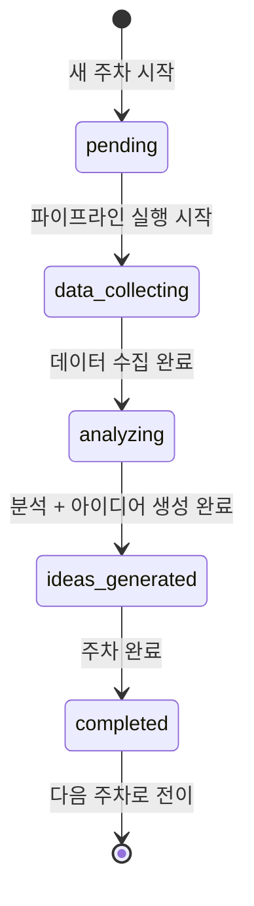
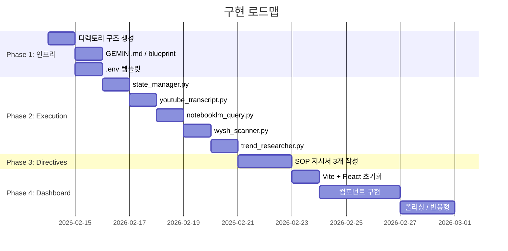

# PLAN.md — WYSH x Seth Godin Marketing Execution Engine 구현 계획

> **버전**: v1.1  
> **작성일**: 2026-02-14  
> **최종 수정**: 2026-02-14  
> **상태**: ✅ 승인 완료 & Phase 5 실행 중  
> **선행 문서**: [SPEC.md](file:///Users/hong/Desktop/Antigravity/This%20Is%20Marketing/SPEC.md)

---

## 목표

"This is Marketing" 23개 챕터를 주 1회 사이클로 분석하여, WYSH 브랜드에 맞는 마케팅 액션 아이디어를 자동 생성하고 대시보드로 시각화하는 시스템 구축.

## User Review Required

> [!IMPORTANT]
> **NotebookLM 노트북 필요**: Seth Godin "This is Marketing" 내용이 포함된 NotebookLM 노트북 URL이 필요합니다. 챕터별 내용을 소스로 업로드해 주세요.

> [!IMPORTANT]
> **YouTube 플레이리스트/영상 URL**: 분석 대상이 되는 Seth Godin 관련 유튜브 영상 URL 목록이 필요합니다.

> [!WARNING]
> **API 키 필요**: `deep-research` 스킬 사용을 위해 `GEMINI_API_KEY`가 필요합니다. Google AI Studio에서 발급받아 주세요.

> [!IMPORTANT]
> **23개 챕터 목록**: "This is Marketing"의 정확한 챕터 제목 목록을 제공해 주시거나, 제가 책 구조를 조사하도록 허용해 주세요.

---

## Proposed Changes

### 인프라 셋업

#### [NEW] [GEMINI.md](file:///Users/hong/Desktop/Antigravity/This%20Is%20Marketing/GEMINI.md)
- Test1 프로젝트의 GEMINI.md를 기반으로 본 프로젝트 맞춤 버전 생성
- 3계층 아키텍처 + 7대 원칙 + 본 프로젝트 운영 원칙 명시

#### [NEW] [blueprint.md](file:///Users/hong/Desktop/Antigravity/This%20Is%20Marketing/blueprint.md)
- 프로젝트 현재 상태 동기화 문서 초기화

#### [NEW] [.env.example](file:///Users/hong/Desktop/Antigravity/This%20Is%20Marketing/.env.example)
- `GEMINI_API_KEY`, `NOTEBOOKLM_NOTEBOOK_URL` 등 필요 환경 변수 템플릿

---

### Directive Layer (SOP 지시서)

#### [NEW] [weekly-analysis.md](file:///Users/hong/Desktop/Antigravity/This%20Is%20Marketing/directives/weekly-analysis.md)
주간 분석 전체 흐름 SOP:
1. `state.json`에서 현재 주차/챕터 확인
2. YouTube 트랜스크립트 추출 실행
3. NotebookLM에 챕터 관련 질의
4. WYSH 컨텍스트 수집 실행
5. AI 분석 및 아이디어 생성
6. 결과 저장 및 상태 전이

#### [NEW] [idea-generation.md](file:///Users/hong/Desktop/Antigravity/This%20Is%20Marketing/directives/idea-generation.md)
마케팅 아이디어 생성 SOP:
- MFS 채점 기준 (WYSH 맞춤 가중치)
- 아이디어 출력 형식 정의
- "Smallest Viable Action" 프레임워크

#### [NEW] [feedback-loop.md](file:///Users/hong/Desktop/Antigravity/This%20Is%20Marketing/directives/feedback-loop.md)
피드백 루프 SOP:
- 이전 주차 결과 스캔 기준
- 성과 평가 지표
- 다음 주차 전략 반영 방법

---

### Execution Layer (실행 스크립트)

#### [NEW] [youtube_transcript.py](file:///Users/hong/Desktop/Antigravity/This%20Is%20Marketing/execution/youtube_transcript.py)
- `youtube-transcript-api` 기반 트랜스크립트 추출
- 입력: YouTube URL 또는 Video ID
- 출력: `data/weeks/week-XX/transcript.md`
- 에러 핸들링: 자막 비활성화, 비공개 영상 등

#### [NEW] [notebooklm_query.py](file:///Users/hong/Desktop/Antigravity/This%20Is%20Marketing/execution/notebooklm_query.py)
- `notebooklm-mcp`를 통한 NotebookLM 질의
- 입력: 주차별 질문 리스트
- 출력: `data/weeks/week-XX/chapter-analysis.md`
- 대안: MCP 실패 시 `notebooklm` 스킬 스크립트로 폴백

#### [NEW] [wysh_scanner.py](file:///Users/hong/Desktop/Antigravity/This%20Is%20Marketing/execution/wysh_scanner.py)
- Playwright 기반 WYSH 쇼핑몰/인스타 스캔
- 입력: `https://wysh.it/`, Instagram `@wyshlifestyle`
- 출력: `data/weeks/week-XX/wysh-context.json`
- 수집 항목: 현재 제품, 프로모션, 최근 게시물 텍스트/해시태그

#### [NEW] [trend_researcher.py](file:///Users/hong/Desktop/Antigravity/This%20Is%20Marketing/execution/trend_researcher.py)
- `deep-research` 스킬 래핑
- 입력: "D2C 식품 트렌드 2026", "Seth Godin 최신 인터뷰" 등
- 출력: `data/weeks/week-XX/trends.md`

#### [NEW] [state_manager.py](file:///Users/hong/Desktop/Antigravity/This%20Is%20Marketing/execution/state_manager.py)
주차별 상태 관리의 핵심 로직:
```python
# 주요 기능:
# 1. state.json 읽기/쓰기
# 2. 현재 주차 -> 다음 주차 자동 전이
# 3. 주차별 디렉토리 자동 생성
# 4. 완료 체크 (모든 파이프라인 정상 동작 확인)
```

**주차별 상태 전이 흐름:**


#### [NEW] [requirements.txt](file:///Users/hong/Desktop/Antigravity/This%20Is%20Marketing/execution/requirements.txt)
```
youtube-transcript-api>=0.6.0
playwright>=1.40.0
httpx>=0.25.0
python-dotenv>=1.0.0
```

---

### Data Layer

#### [NEW] [state.json](file:///Users/hong/Desktop/Antigravity/This%20Is%20Marketing/data/state.json)
- 전역 상태 파일 (SPEC.md의 스키마 참조)
- 초기값: `current_week: 1`, `status: "pending"`

#### [NEW] `data/weeks/week-01/` ~ `week-23/`
- 필요 시 `state_manager.py`가 자동 생성
- 처음부터 모두 만들지 않음 (불필요한 빈 디렉토리 방지)

---

### Dashboard UI (Phase 4)

#### [NEW] `dashboard/` (Vite + React)
- `npx -y create-vite@latest ./dashboard --template react` 으로 초기화
- 컴포넌트 구조:
  - `WeekProgressBar.jsx` — 23주 진행 상태 바
  - `ChapterCard.jsx` — 챕터 핵심 원칙 요약
  - `IdeaCard.jsx` — MFS 점수 포함 아이디어 카드
  - `WyshContextPanel.jsx` — 쇼핑몰/인스타 스냅샷
  - `HistoryTimeline.jsx` — 지난 주차 요약
  - `ExecutionLogger.jsx` — Firebase 연동 실행 계획 CRUD
- `hooks/` 에 데이터 로딩/전환 로직 격리
- `data/` 디렉토리의 JSON 파일을 직접 import 하거나 API로 제공

---

### Firebase 연동 (Phase 5)

#### [NEW] [firebase.js](file:///Users/hong/Desktop/Antigravity/This%20Is%20Marketing/dashboard/src/firebase.js)
- Firebase App & Firestore 초기화
- `execution_plans` 컬렉션으로 실행 계획 CRUD
- Cloudflare 배포를 위해 설정값 하드코딩 (프로토타입 단계)

---

## 구현 순서



---

## Verification Plan

### 자동화 테스트

| 테스트 | 명령어 | 검증 내용 |
|--------|--------|-----------|
| state_manager 유닛 테스트 | `python -m pytest execution/tests/test_state_manager.py -v` | 상태 전이, 주차 디렉토리 생성, JSON 읽기/쓰기 |
| youtube_transcript 테스트 | `python execution/youtube_transcript.py --url "https://youtu.be/TEST_ID" --dry-run` | URL 파싱, 에러 핸들링 (실제 API 호출 없이) |
| 대시보드 빌드 검증 | `cd dashboard && npm run build` | 빌드 에러 없음 확인 |

### 수동 검증 (사용자 참여 필요)

1. **NotebookLM 연동 테스트**
   - 사용자가 NotebookLM 노트북 URL을 제공한 뒤
   - `notebooklm_query.py`로 테스트 질의를 보내 응답 확인
   - 예상 결과: 소스 기반 응답 반환

2. **WYSH 쇼핑몰 스캔 테스트**
   - `wysh_scanner.py`를 실행하여 `https://wysh.it/` 스캔
   - 예상 결과: 제품 목록 / 프로모션 정보가 JSON으로 출력

3. **대시보드 UI 확인**
   - `cd dashboard && npm run dev` 실행
   - 브라우저에서 `http://localhost:5173` 접속
   - 예상 결과: 주차 진행 바, 챕터 카드, 아이디어 카드가 렌더링됨

4. **E2E 주간 사이클 테스트**
   - Week 1 전체 파이프라인을 수동으로 실행
   - 모든 `data/weeks/week-01/` 파일이 정상 생성되는지 확인
   - `state.json`이 `current_week: 2`로 전이되는지 확인

---

## 비즈니스 리스크 & 대안 제안

> [!TIP]
> **리스크 1: 23주는 너무 길다**  
> 한 사이클이 약 6개월. 중간에 관심이 떨어질 수 있습니다.  
> **대안**: 핵심 챕터 10개를 선별하여 "10주 집중 사이클"로 시작하고, 이후 확장하는 전략을 추천합니다.

> [!TIP]
> **리스크 2: Instagram 스크래핑은 불안정하다**  
> Meta의 봇 차단 정책이 강화되고 있습니다.  
> **대안**: Instagram Basic Display API 또는 수동 CSV 업로드 방식을 병행 지원하면 안정성이 높아집니다.

> [!TIP]
> **리스크 3: 자동화 수준의 기대치 관리**  
> 현재 구조는 "에이전트가 매주 수동으로 실행"하는 반자동 방식입니다. 완전 자동(cron job 등)은 Phase 5로 분리하는 것을 권장합니다.

---

## 승인 체크리스트

사용자에게 확인받을 항목:
- [ ] SPEC.md 내용 동의
- [ ] PLAN.md 구현 순서 동의
- [ ] NotebookLM 노트북 URL 제공 가능 여부
- [ ] YouTube 영상 URL 목록 제공 가능 여부
- [ ] GEMINI_API_KEY 발급 가능 여부
- [ ] 23주 vs 10주 집중 사이클 선택
- [ ] 코딩 착수 승인
