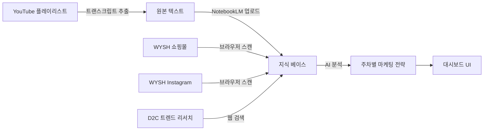

# SPEC.md — WYSH x Seth Godin Marketing Execution Engine

> **버전**: v1.0  
> **작성일**: 2026-02-14  
> **상태**: 설계 승인 대기  

---

## 1. 프로젝트 개요

### 1.1 미션
Seth Godin의 "This is Marketing"을 **챕터별로 분석**하고, 그 마케팅 철학을 **WYSH**(무지방 고단백 그릭요거트) 브랜드에 맞는 **실행 가능한 전략**으로 자동 변환하는 시스템.

### 1.2 핵심 가치
| 항목 | 설명 |
|------|------|
| **브랜드** | WYSH (무지방 고단백 그릭요거트) |
| **핵심 소재** | Seth Godin "This is Marketing" (23개 챕터) |
| **결과물** | 매주 갱신되는 대시보드 + 마케팅 액션 아이디어 |
| **운영 주기** | 주 1회 자동 반복 (23주 사이클) |

### 1.3 유저 페르소나
- **WYSH 마케팅 담당자**: 매주 대시보드를 확인하고, 제안된 액션 아이디어 중 실행할 것을 선택한다.
- **WYSH 대표**: 전체 진행 상황과 전략 방향을 조감도로 확인한다.

---

## 2. 기능 요구사항

### 2.1 데이터 파이프라인 (자동)



#### P1: YouTube 트랜스크립트 추출
- Seth Godin 관련 유튜브 영상에서 트랜스크립트를 추출한다.
- `youtube-summarizer` 스킬의 `youtube-transcript-api`를 활용한다.
- 출력: 마크다운 형식의 요약 + 원본 트랜스크립트 텍스트.

#### P2: NotebookLM 연동
- 추출된 트랜스크립트와 챕터 내용을 NotebookLM에 질의한다.
- `notebooklm-mcp` 서버 또는 `notebooklm` 스킬 스크립트를 활용한다.
- 출력: 소스 기반의 인사이트 및 개념 정리.

#### P3: WYSH 브랜드 컨텍스트 수집
- `https://wysh.it/` 쇼핑몰 페이지를 스캔하여 현재 제품 라인업, 프로모션, 콘텐츠를 파악한다.
- Instagram `@wyshlifestyle` 피드를 스캔하여 최근 콘텐츠 톤/테마를 분석한다.
- `browser-automation` 스킬(Playwright)을 활용한다.

#### P4: D2C 식품 트렌드 리서치
- Seth Godin 최신 인터뷰, D2C 식품 업계 동향을 웹 검색으로 수집한다.
- `deep-research` 스킬을 활용한다.

### 2.2 분석 및 아이디어 생성 (AI)

#### A1: 챕터 분석
- 지정된 챕터의 핵심 원칙을 추출한다.
- WYSH 브랜드 맥락에서 적용 가능성을 평가한다.

#### A2: 마케팅 아이디어 도출
- 챕터 원칙 기반으로 3개 이상의 **"Smallest Viable Action"** 을 제안한다.
- `marketing-ideas` 스킬의 **MFS(Marketing Feasibility Score)** 로 각 아이디어를 채점한다.
- MFS 4점 이상인 아이디어만 최종 추천한다.

#### A3: 피드백 루프
- 이전 주차의 액션 실행 결과를 스캔(쇼핑몰/인스타그램 변화)한다.
- 성과 데이터를 다음 주차 전략에 반영한다.

### 2.3 대시보드 UI

| 구성 요소 | 설명 |
|-----------|------|
| **주차 진행 바** | 현재 N/23주차 진행 상태 표시 |
| **챕터 요약 카드** | 이번 주 챕터의 핵심 원칙 3개 |
| **아이디어 카드** | MFS 점수 포함 3~5개 액션 아이디어 |
| **WYSH 컨텍스트 패널** | 최신 쇼핑몰/인스타 스냅샷 |
| **히스토리 뷰** | 지난 주차들의 요약 타임라인 |

---

## 3. 비기능 요구사항

### 3.1 아키텍처 원칙 (GEMINI.md 7대 원칙 적용)

| # | 원칙 | 본 프로젝트 적용 |
|---|------|------------------|
| 1 | **Atomic Modularity** | 파이프라인 각 단계를 독립 스크립트로 분리. UI 컴포넌트는 단일 책임. |
| 2 | **Explicit Full Output** | 모든 코드 출력 시 생략 없음. |
| 3 | **Readability First** | 한국어 주석, 직관적 변수명 사용. |
| 4 | **Spec-First** | 본 SPEC.md + PLAN.md 승인 후 코딩 착수. |
| 5 | **Robust Error Handling** | API 실패, 네트워크 오류, 빈 응답 등 모든 엣지케이스 방어. |
| 6 | **Intentional Documentation** | 모든 주석에 "왜(Why)" 기술. 한국어 작성. |
| 7 | **Incremental Refactoring** | 기능 3회 구현마다 기술 부채 점검. 범위 외 변경 금지. |

### 3.2 3계층 아키텍처 적용

```
This Is Marketing/
├── GEMINI.md              # 프로젝트 가이드라인
├── SPEC.md                # 본 문서
├── PLAN.md                # 구현 계획
├── blueprint.md           # 현재 상태 동기화
├── .env                   # 환경 변수 (API 키 등)
│
├── directives/            # Layer 1: 자연어 SOP 지시서
│   ├── weekly-analysis.md
│   ├── idea-generation.md
│   └── feedback-loop.md
│
├── execution/             # Layer 3: 실행 스크립트
│   ├── youtube_transcript.py
│   ├── notebooklm_query.py
│   ├── wysh_scanner.py
│   ├── trend_researcher.py
│   └── state_manager.py
│
├── data/                  # 주차별 데이터 저장
│   ├── state.json         # 전역 상태 (현재 주차, 진행 상황)
│   ├── weeks/
│   │   ├── week-01/
│   │   │   ├── transcript.md
│   │   │   ├── chapter-analysis.md
│   │   │   ├── wysh-context.json
│   │   │   ├── ideas.json
│   │   │   └── feedback.json
│   │   └── week-02/ ...
│   └── wysh-snapshot/     # 쇼핑몰/인스타 스냅샷 캐시
│
└── dashboard/             # React 대시보드 (Vite)
    ├── src/
    │   ├── components/
    │   ├── hooks/          # 비즈니스 로직 격리
    │   ├── data/           # ../data 와 연결
    │   └── App.jsx
    └── package.json
```

### 3.3 주차별 상태 관리

**`data/state.json` 스키마:**
```json
{
  "project": "WYSH x Seth Godin",
  "total_weeks": 23,
  "current_week": 1,
  "current_chapter": "Chapter 1: ...",
  "status": "in_progress",
  "history": [
    {
      "week": 1,
      "chapter": "Chapter 1: ...",
      "started_at": "2026-02-14T10:00:00+09:00",
      "completed_at": null,
      "ideas_count": 0,
      "feedback_applied": false
    }
  ]
}
```

---

## 4. 활용 도구 (Skills & MCP)

| 도구 | 용도 | 타입 |
|------|------|------|
| `youtube-summarizer` | 유튜브 트랜스크립트 추출 + 요약 | AI Skill |
| `notebooklm-mcp` | NotebookLM 지식 베이스 질의 | MCP Server |
| `notebooklm` (Skill) | NotebookLM 스크립트 기반 질의 (백업) | AI Skill |
| `browser-automation` | WYSH 쇼핑몰/인스타그램 스캔 | AI Skill |
| `deep-research` | D2C 트렌드/최신 인터뷰 리서치 | AI Skill |
| `marketing-ideas` | MFS 기반 마케팅 아이디어 채점 | AI Skill |

---

## 5. 제약 사항 및 리스크

| 리스크 | 영향도 | 대응 방안 |
|--------|--------|-----------|
| NotebookLM 일일 쿼리 제한 (50회/무료) | 높음 | 질의를 배치로 최적화. 주 1회 실행이므로 충분할 것으로 예상. |
| YouTube 트랜스크립트 미제공 영상 | 중간 | 해당 영상 스킵 후 수동 입력 옵션 제공. |
| Instagram 접근 차단 (로그인 필요) | 높음 | 공개 프로필만 스캔. 차단 시 수동 스크린샷 업로드로 대체. |
| WYSH 쇼핑몰 구조 변경 | 낮음 | 스크래핑 셀렉터를 directive에 관리하여 수정 용이. |

---

## 6. 성공 지표

- 23주 사이클 1회 이상 완주
- 매주 3개 이상의 MFS 4+ 아이디어 생성
- 대시보드를 통한 진행 상태 실시간 확인 가능
- 피드백 루프를 통한 전략 개선 반영
